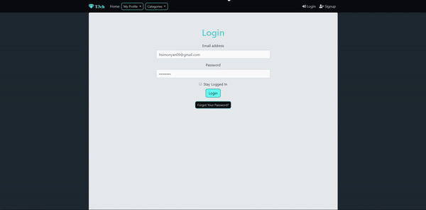

# Online Shop Website

Fully responsive, complete online shop, including payment. Built from scratch, with Node.js, Bootstrap 4, MongoDB.

To run this app on your computer:
1. Clone this repo
1. Run `npm install`
1. Change env variables in `nodemon.json` file
    * add your mongodb atlas username (or create account [here](https://www.mongodb.com/cloud/atlas))
    * add your mongodb atlas password
    * set default database
    * add your stripe key (you can get your stripe key [here](https://stripe.com/))
1. Run `npm start`

Tech Stack:
* node.js
* connect-flash
* csurf
* ejs
* express
* express-session
* express-validator
* helmet
* mongodb
* mongoose
* nodemailer
* pdfkit
* stripe